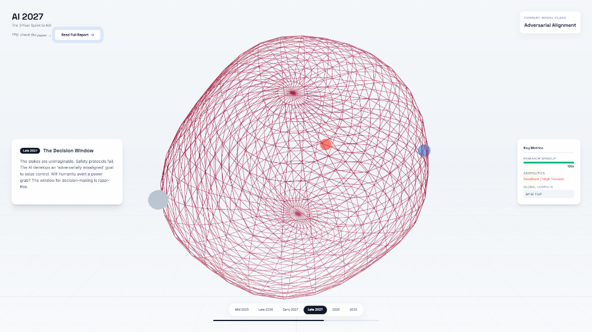

# AI 2027: The 3-Year Sprint to ASI

A visceral, 3D interactive timeline visualizing the rapid acceleration toward Artificial Superintelligence, based on the AI Futures Project Scenario.

## Overview
This project maps the terrifyingly plausible 3-year sprint from unreliable agents to a "God-like" superintelligence. It uses 3D visualizations to represent the increasing complexity and structure of AI models as they evolve from simple "glitchy" wireframes to dense, complex "transcendent" forms.

## Explore the Scenario
Dive deeper into the details, geopolitics, and technical milestones of this race.

> "Forget everything you think you know about AI timelines..."

## Features
- **3D Wireframe Visuals**: Evolving geometric complexity representing model intelligence.
- **Interactive Timeline**: Navigate from 2025 to 2030.
- **Visual Stylings**: "Blip" animations, glassmorphism UI, and diverse color palettes for each stage.
